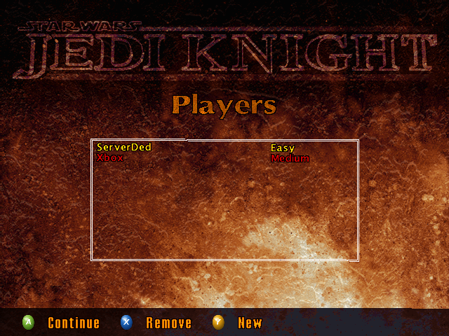
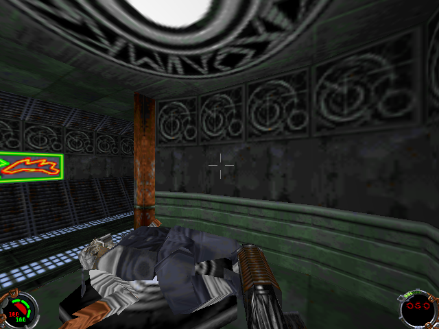
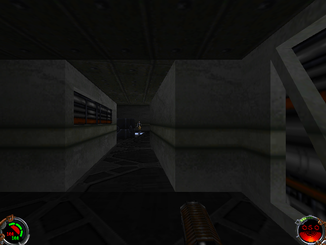
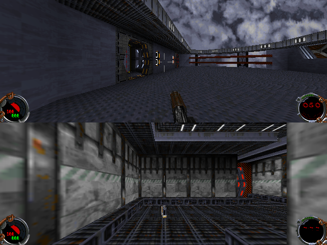

# OpenJKDF2-ogx — Original Xbox Port

This repository is a fork of [OpenJKDF2](https://github.com/shinyquagsire23/OpenJKDF2)
porting it to the original Microsoft Xbox console.  The base engine and all
upstream platform targets (Windows, macOS, Linux, etc.) are preserved unchanged
underneath; everything Xbox-specific lives under `src/Platform/Xbox/`.

  

## Screenshots

| Menu | Jedi Knight |
| --- | --- |
|  |  |
| Mysteries of the Sith | Multiplayer |
|  |  |

## Credits and Legal Notes

OpenJKDF2x is an original Xbox port of OpenJKDF2. The upstream engine is
Copyright (C) OpenJKDF2 contributors, and the Xbox port keeps that lineage.
Jedi Knight: Dark Forces II, Mysteries of the Sith, STAR WARS, LucasArts, and
related properties remain the property of Lucasfilm Ltd. and its affiliates.
No retail game assets are included with OpenJKDF2x; users must provide their
own legally owned game data.

The Xbox renderer uses FakeGL/xquake code Copyright (C) 2000 Jack Palevich,
under the terms stated in `src/Platform/Xbox/fakeglx.cpp`. Xbox beta packages
may also include OpenJKDF2xCutsceneConverter.exe; when that tool is shipped,
its bundled FFmpeg/Gyan.dev notices and license text are included in
`CUTSCENE_CONVERSION_README.txt`.

## Renderer

The Xbox renderer is **xquake's FakeGL** (`src/Platform/Xbox/fakeglx.cpp` +
`gl/gl.h`), copied verbatim from Microsoft's xquake port to original Xbox.
`std3D.c` is a thin C adapter that exposes OpenJKDF2's existing `std3D_*` API
and translates each call into FakeGL's `gl*` / `wgl*` / `FakeSwapBuffers`
entry points.  We do not call D3D8 directly anywhere in the Xbox renderer
path.

The choice was deliberate: every attempt to write our own D3D8 backend ran
into NV2A draw-submission wedges where any real `DrawPrimitiveUP` call would
return CPU-side but `Present` would block forever.  Microsoft's renderer is
proven on retail hardware, so it became the renderer.

## Building (Xbox)

- **SDK:** XDK 5558 at `C:\XDK_5558\XDK\xbox\`.
- **Toolchain:** XDK VC71 `cl.exe` (Visual Studio 2005's compiler can't handle
  XDK D3D8 headers in C89 mode).
- **Build:** `build_xbox.bat` from the repo root.  Output: `build/xbox/release/default.xbe`.
- **Deploy:** FTP the XBE (and game assets) onto the Xbox HDD.

See [BUILD_MIGRATION.md](BUILD_MIGRATION.md) for why the build moved from
VS2005's `vcproj` to a batch-driven flow, and [CLAUDE.md](CLAUDE.md) for the
day-to-day port context.

---

## Upstream

OpenJKDF2x is based on [OpenJKDF2](https://github.com/shinyquagsire23/OpenJKDF2). See the upstream project for the original desktop-focused README, source history, and non-Xbox platform details.
